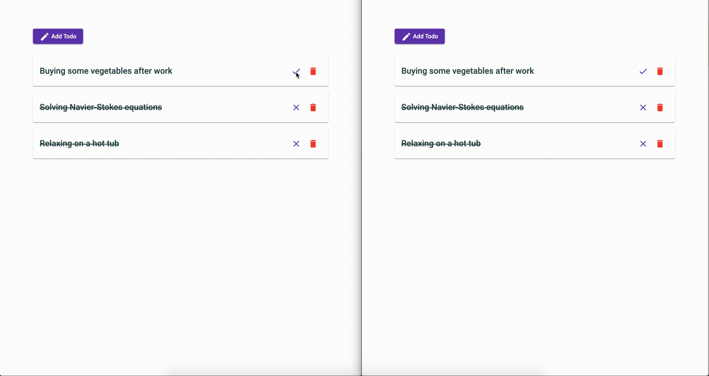

# sync-tabs
[](https://app.netlify.com/sites/kind-bose-068089/deploys)

Synchronizing Redux state (NgRx) accross multiple tabs.

## Demonstration



## Getting Started

- Install dependencies
```bash
yarn install
```

- Start the app, which will be available at `http://localhost:4200`
```bash
yarn start
```

## Sync Service

The sync service, which is the purpose of this repository, is in `./src/app/services/sync-store.service.ts`.